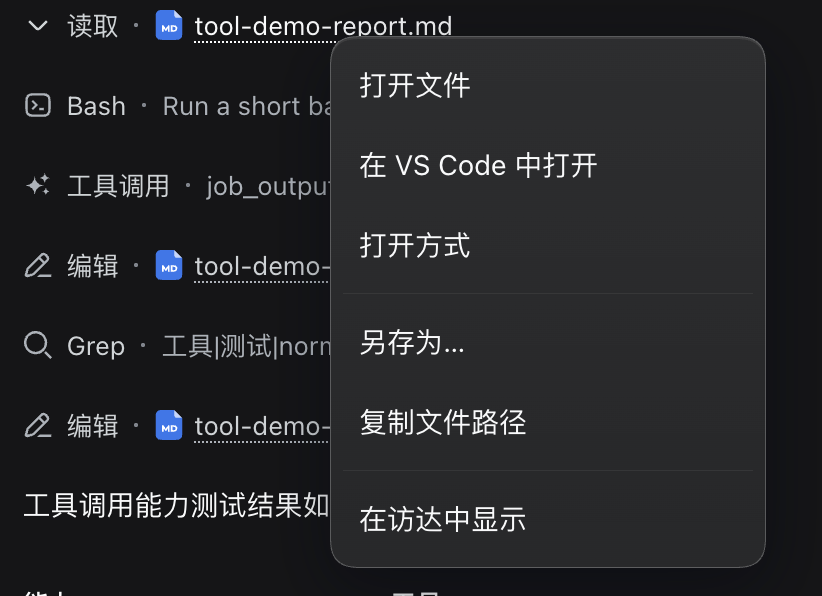
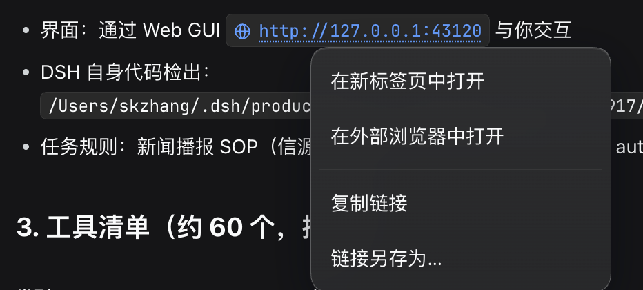
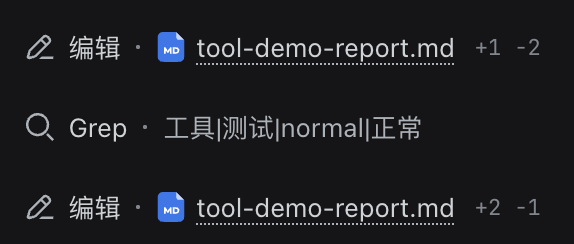
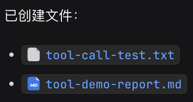
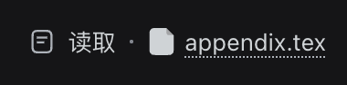

# dsh-file-link-menu

为 DSH Web 界面提供文件与链接的右键菜单，并把路径 chip 显示成「文件类型图标 + 文件名」（English: [README.md](README.md)）。

## 功能

在产物文件 chip、交付文件卡片、回复里的内联路径，或外部链接上点右键，菜单只给出该目标真正支持的项：

| 目标 | 菜单项 |
| --- | --- |
| 文件（交付卡片 / 产物 chip / 内联路径） | 打开文件（系统默认应用）· 在 VS Code 中打开 · 打开方式 ▸（已探测到的应用）· 另存为… · 复制文件路径 · 在文件管理器中显示 |
| 外部链接（`http`/`https` 锚点或选中的裸 URL） | 在新标签页中打开 · 在外部浏览器中打开 · 复制链接 · 链接另存为… |

<p align="center">
  
  <br>
  
</p>

每一项都按宿主自报的能力组合（`GET /api/dsh-file-link-menu/caps`）：没有桌面会话的宿主会隐藏启动类菜单项，而不是给出必然失败的按钮。

### 路径 chip 显示类型图标与文件名

对话里出现的路径——工具行的参数路径、回复里的内联路径、产物 chip、用户写的 `@` 引用——都会被改写成「文件类型图标 + 文件名」。完整路径不丢：它被记在元素上（`data-flm-full-path`），悬停可见，也是菜单所有动作真正操作的路径。

<p align="center">
  
  <br>
  
</p>

图标用的是 DSH 自己的图形资源（共享 UI primitives 里的 `FileTypeIcon`），所以 `.tsx` chip 显示 React 原子、`.md` 显示 Markdown 标记，而未来 shell 新增的分类无需改本插件即可生效。插件识别不了的 chip——包括本来就画了图标和短名的交付卡片——完全保留官方渲染。

<p align="center">
  
</p>


附件卡片（对话里已发送的附件、输入框里待发送的附件）同样支持：左键在右侧边栏预览，右键给出与文件相同的菜单项。卡片上只有文件名、没有路径，因此由宿主把名字解析成附件仓库中的真实路径；仓库按内容寻址，所以重名时取最近写入的那一个。

用户自己写的 `@` 引用在消息发出后会渲染成一枚文件 chip：右键同样给出这套文件菜单，左键一般保持 shell 自己的行为——**例外是粘贴出来的文件**：`dsh-auto-paste` 用文件名（`paster-…`）而不是那条很长的仓库路径来引用它，而名字本身不是路径，所以本插件按名字回查附件库、自己把它开在右侧边栏。

## 安装

```sh
# 从 npm 安装（预构建，无需构建步骤）
dsh plugin --profile web add dsh-file-link-menu

# 或直接从仓库安装
dsh plugin --profile web add github:shkzhang/dsh-file-link-menu
```

重启 `dsh web`（或承载它的应用封装端），刷新页面即可生效。

npm 包与仓库都已包含构建好的 `lib/`，两条路径都不会在你机器上触发构建。若用源码检出（而非 git spec）安装，会执行仓库内的 `prepare`，它不依赖仓库外的任何文件。

## 实现方式与前提

Web 客户端的插槽表里没有"文件/链接菜单"这一层，因此本插件无法往官方菜单里追加项。它改为在捕获阶段监听 `contextmenu`（菜单）与 `click`（附件预览），按官方已发布的锚点识别目标：

- `[data-presented-files-row]`——交付文件卡片，路径在 chip 的 `title` 上；
- `[data-produced-files-row]`——产物文件 chip，同样用 `title` 携带全路径；
- 带路径形状 `title` **且**有可访问标签的 `button[title]`——内联路径引用；
- `button[data-ref-chip="file"]`，`title` 是完整的 `@` 引用 token（`@path`，含空格时 `@"path"`）——用户在消息里写的引用；token 是粘贴文件名（`paster-…`，`dsh-auto-paste` 的命名）时它指的是附件而不是路径，由宿主回查附件仓库；
- `a[href]`，且属性原值是绝对的 `http(s)` 地址；
- `[data-message-attachments]`——对话里的附件行，卡片 `title` 是附件显示名；
- 输入框的待发送附件栏：带 `role="group"` 的栏，栏内每一项里的卡片同样用 `title` 携带显示名。

其余情况一律保留官方菜单，包括同页锚点与相对链接；已被其它监听器接管的右键事件也不会被本插件抢走。附件栏由 CSS Modules 生成类名（带构建哈希前缀），插件按类名末尾的本地名匹配，重新构建后依然成立。

宿主条目注册在输入框的 `conversation.input.overlay`（列表槽）里，渲染不出任何可见内容：会话在还没有消息时不会渲染会话头部，而那正是输入框里挂着刚粘贴附件的会话。菜单与 Toast 都通过 portal 挂到页面上，因此该位置不会被裁切或影响布局。

**锚点失效只影响对应界面。** 若未来 DSH 改动这些锚点，`detectTarget` 就不再识别该界面，官方菜单照常打开，不会碰任何会话数据。锚点及其失效条件集中在 `src/client/surfaces.ts`。

### 显示层

同一套锚点也驱动 chip 改写，代码分在三个文件：`chips.ts` 识别 chip 并算出该显示的名字，`icons.ts` 把共享的 `FileTypeIcon` 按文件类型渲染一次到游离的 React root，并为图形里的渐变 id 生成本实例专属的值，`enhance.ts` 从变更流上驱动这两步。

有两个实测结论决定了这个设计的形状，`tests/chips.spec.ts` 都覆盖了：

- React 在 chip 自身 props 不变时会容忍被插入的节点，但一旦某个 prop 变化就会重写文本、重建该按钮的子节点——流式工具调用每时每刻都在这样做。所以显示层在每次提交后重新执行，并记录自己写过的名字（`data-flm-shown`），以此区分「自己缩短过的 chip」和「之后被 shell 覆写的 chip」。没有这个记录，重渲染后的 chip 会一直显示上一个文件的名字。
- `useId` 在复用的 root 里每次渲染都返回同一个值，所以按类型缓存会让同类型的每个 chip 拿到同一个 id；而 `url(#…)` 只解析到文档里第一个匹配，删掉那个 chip 就会让其余的填充全部失效。因此 id 按实例加后缀，且是**追加而不是替换**：同一份图形里有多个 id，它的各个形状分别引用它们。

显示层对 shell 自己画的图标只隐藏、不删除：那个节点仍归 React 所有，移出 DOM 会让虚拟 DOM 与文档不一致。识别不了、拿不到图标、或者算不出名字的 chip，一律保持官方渲染。

## 宿主路由

| 路由 | 方法 | 用途 |
| --- | --- | --- |
| `/api/dsh-file-link-menu/caps` | GET | 平台、文件管理器类型、可启动的应用 |
| `/api/dsh-file-link-menu/attachment` | POST | 把附件显示名解析成仓库里的真实路径 |
| `/api/dsh-file-link-menu/open` | POST | 用系统默认应用打开会话内文件 |
| `/api/dsh-file-link-menu/reveal` | POST | 在文件管理器中定位文件 |
| `/api/dsh-file-link-menu/open-with` | POST | 用指定应用打开文件 |
| `/api/dsh-file-link-menu/download` | GET | 以附件流式下载会话内文件 |
| `/api/dsh-file-link-menu/save-as` | POST | 把会话内文件复制到用户选定的目录 |
| `/api/dsh-file-link-menu/open-url` | POST | 把链接交给系统默认浏览器 |
| `/api/dsh-file-link-menu/download-link` | GET | 以附件流式下载远端链接 |
| `/api/dsh-file-link-menu/save-link-as` | POST | 把远端链接写入用户选定的目录 |

路由强制的保证：

- 每条路由先向组合里的 `connection` 服务请求 Host/Origin 与登录校验，未通过直接拒绝；
- 请求的路径必须是宿主自己给出的两个根之一，**跟随符号链接后**仍然成立：会话工作区（相对路径只按它解析），以及 dsh 的附件仓库。仓库之所以是根，是因为粘贴出来的附件本来就落在所有工作区之外，而卡片上只有文件名——浏览器只知道 `/attachment` 路由返回的仓库内路径。两个根之外的路径、URL 形状的值、不存在的文件、没有可解析工作区时的相对路径、仓库里查不到的附件名，全部拒绝，因此菜单不会变成"任意文件读取/打开"的入口；
- 启动命令是 argv 数组，直接 `spawn`，不经过 shell；
- "链接另存为"只接受 `http`/`https`，逐跳重新校验重定向，拒绝回环与内网地址，并限制时间与体积。这条拒绝只属于**宿主自己去连**的那两条路由；"在外部浏览器中打开"是把 URL 交给用户自己的浏览器，而那本来就是这个页面已有的可达性（隔壁那行"在新标签页中打开"连宿主都不经过），所以回环/内网地址在这一行是放行的——本机面板、内网服务照常打开。

## 配置

无。体积、超时、重定向上限是协议常量（见 `src/shared.ts`），不是部署可变项。

## 开发

```sh
pnpm install
pnpm run typecheck
pnpm test
pnpm run build
```

`lib/index.js` 是宿主端，`lib/client.js` 是浏览器端产物，由 shell 的模块加载器以 `dsh-file-link-menu` 为 id 注册。

本仓库是自包含的：TypeScript 与测试配置都不引用仓库外的文件，所以全新克隆可以独立构建与测试。官方 `@deepseek-ai/*` 包声明为 `peerDependencies`，且每个范围都带显式的预发布分支——不带分支的范围会静默排除 harness 的预发布构建。
